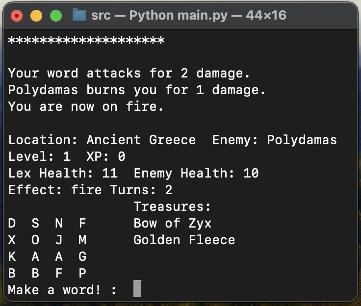
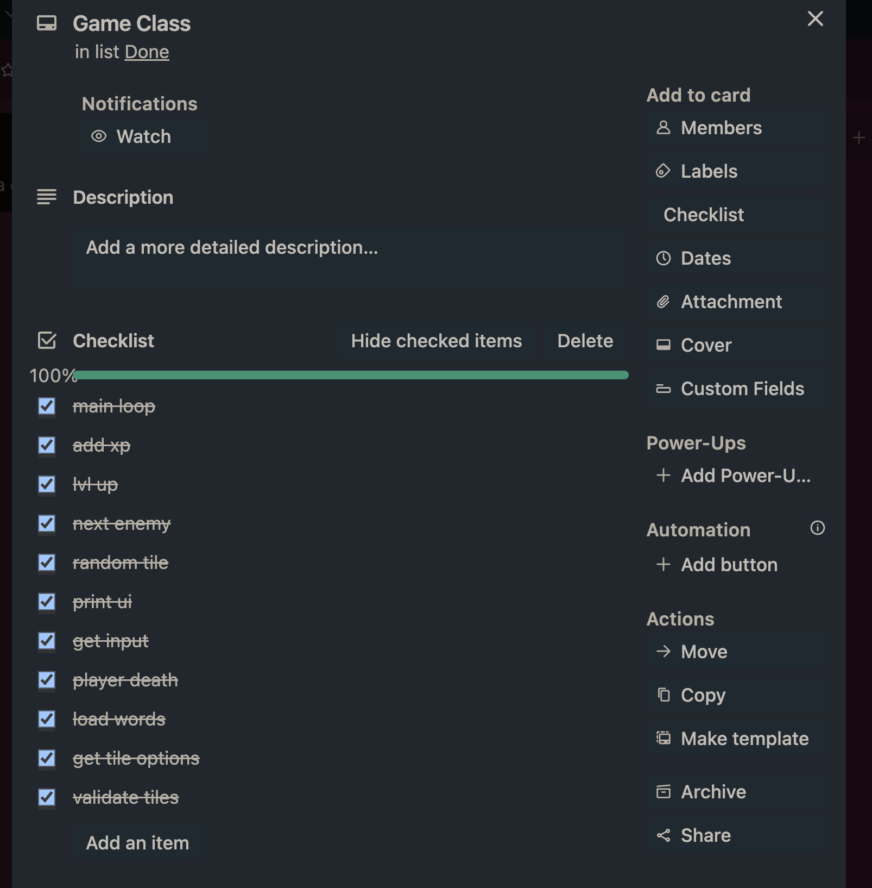
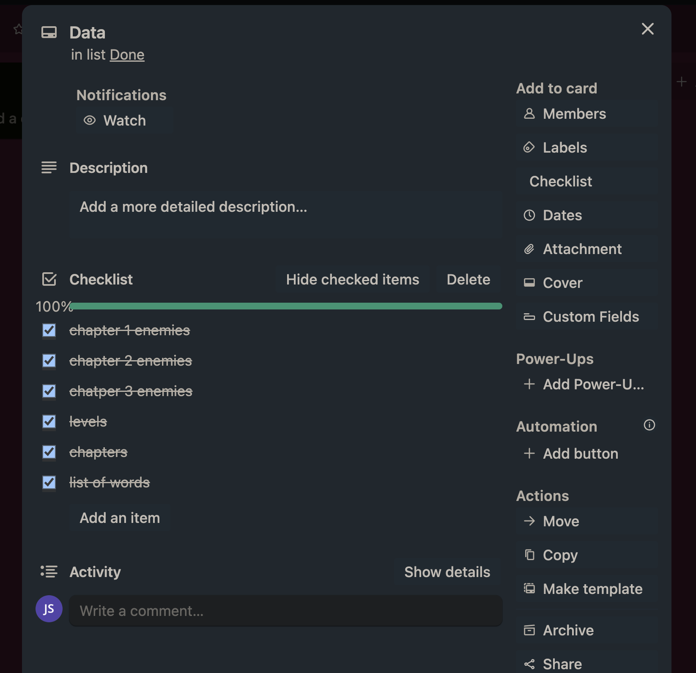
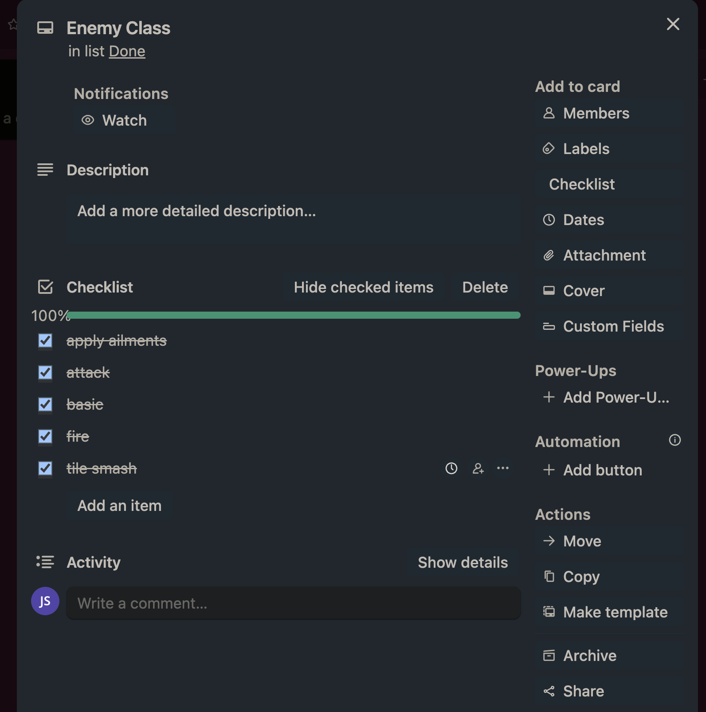
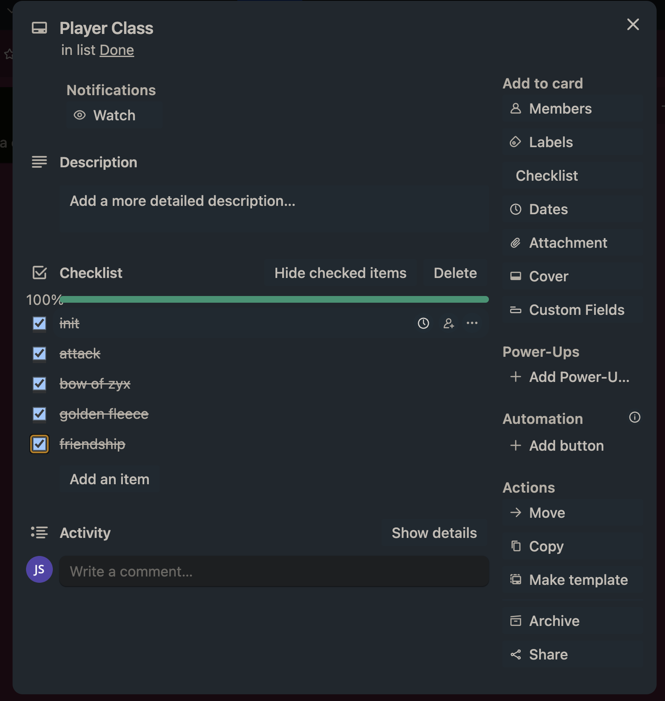

# T1A3: Bookworm Adventures Terminal Clone

Jacob Smith

## Github link

[Link](https://github.com/intameli/T1A3)

## Style conventions

[PEP 8](https://peps.python.org/pep-0008/)

[Google style docstrings](https://google.github.io/styleguide/pyguide.html)

## Help

### Installation

Run `bash script.sh` in your terminal at the programs directory to start

### Requirements

- python 3.6 or higher
- bash

Should run on any computer that meets those two. 3.6 required due to using fstrings. The program has no dependencies.

### How to play

When the game starts you can choose between long and short modes. In long you face all 13 enemies. In short you only face the three bosses and you level up much faster. Short mode is a fast way to see all the mechanics in the game.

/quit to exit game.

/scramble to skip your attack and get all new tiles.

Fight the enemies by making words out of the 16 random letter tiles. You can only use each letter as many times as it appears. Your damage is determined by word length and letter rarity. Each tile you use is replaced by a new random tile at the end of your turn. Minimum word length is 3 tiles.

Enemies have various attacks they can use against you so watch out. Some even last multiple turns. As you beat each enemy you gain XP and will eventually level up. Each location has a boss and a treasure at the end. Treasures help you out in some way.

Treasures:

The Bow of Zyx: Increases damage done by X, Y and Z letter tiles

Golden Fleece: Increases player health

## Features

### Core gameplay loop

The core gameplay loop consists of displaying the UI, getting input and then displaying the resulting changes. This is the order the program executes these step in the code. However, due to the program pausing for player input, the player sees the output from the previous turn first.

Under the previous input, a line of stars is printed so that each turn can be differentiated. Below that, outputs from what happened in the previous turn are printed by various functions. I will go into more detail about this in each features specific section. The outputs you might see here include your attack, the enemies attack, ailments that have begun or ended, whether you have defeated an enemy and a new one has appeared, treasures you have obtained and the next chapter/location you will be entering.

Variables from all the other features are displayed in the UI. Player health, enemy health, location, enemy name, player level and player XP are all displayed every time. If any ailments are affecting the player they are optionally shown. Also optionally, if at least one treasure has been found they are displayed in a column.

Above the input, the tiles the player can use to make words are displayed. The 26 possible tiles correspond to the 26 letters of the alphabet except for Q which is joined with a u to make a Qu tile representing both letters used together. There is still an individual U tile. The "random" tiles are chosen randomly from a list of the possible tiles where the vowels appear twice in the list making them more likely to be chosen.

A prompt asking for the player to make a word is displayed next to the user input. Possible valid inputs include a word made of the tiles that is also in the dictionary, /quit to quit the program and /scramble to get random new tiles at the cost of not attacking for a turn. If the input is not one of those options, a message is displayed providing the reason for its rejection.

The finished version of what this all looks like can be seen below.

#### Next Enemy

When the enemies health is less than or equal to 0, lots happens. If the enemy isn't a boss the player progresses to the next enemy. If it is the last enemy in the chapter i.e. a boss, the player progresses to the next chapter and receives the treasure from the chapter they just completed. If the chapter was the last one, game over is triggered. While progressing to the next enemy, player health is reset to player max health and player weights are reset to master weights (This is because an enemy could die while affecting the letter weights and they would be off for the rest of the game)

### Data

I made the design decision early on that I would decouple the rules of the game from the content. In practice this meant that instead of writing a class for every enemy in the game I wrote one enemy class that had every attack and created instances of it by unpacking a dictionary into its arguments. This allowed me to write the content of the game i.e the enemies stats and moves, also the chapters and levels, as just lists of dictionaries. I think this makes the game easy to expand as new enemies and chapters can easily be created that use the existing moves. The separation just feels right to me.

I found a site that had the Bookworm Adventures word list so as far a I am aware I am using the same dictionary as the real game. (link in References)

### Enemy Class

The Enemy classes are created when each chapter starts. The arguments for each are unpacked from a dictionary in a list of enemies. Each enemy also takes the Player as an argument so it can change its health, and the Game object so that the tile_smash attack can access the current tiles.

#### Attack

Each enemy has a list of attacks. Every attack cycles to the next one. When the end of the list is reached, the first move becomes the active move.

##### Ailments

The first thing that happens when the enemy attacks is that it runs all the functions stored inside dictionaries in the ailments list. There are two possible named functions that a previous attack could have defined. The apply function is called every time if it exists. If the turn value is 0 then the end function is called if it exists. Then the ailment is removed.

##### Attack methods

The active move is run by getattr() using the type value inside the attack dictionary that that is passed into the class. Every attack has a type. Different types of moves pass in different values.

Basic attacks just have a dmg value. Pretty basic

The other 2 attacks, fire and tile_smash have a value called turns. Both of these attacks need to copy the attack dictionary because the turns value is mutated by ailments and I want it to be unique for each attack.

Fire attacks also have dmg. The method damages the player and then defines two functions inside the copied attack dictionary that is then added to the ailments list. The apply function damages and prints and the end function just prints that it's over. This allows the attack to do damage over multiple turns.

The tile_smash attack also adds an ailment. It doesn't take dmg, just turns and type. This attack picks a random tile and changes the weight of all instances of that tile to 0 (so it no longer contributes to damage). The weight that was taken from the letter is stored in a variable so it can be used in the end function to return the letter to its original weight.

### Player Class

#### Player Attack

Luckily the wiki for Bookworm Adventures has the tables that are used in the game to calculate player damage. There is one table that has the weight of each letter. The weights of the word are summed up and rounded down to the nearest integer. The rounded total is fed into another table that gives the damage. Both tables are implemented as dictionaries in the code. Dmg is then multiplied by dmg_multi as this value can change as you lvl up.

#### Treasures

When a boss is beaten, getattr() is used in Game to call a treasure function in Player.

### Additional documentation

running `bash generate_docs.sh` in the terminal at the programs directory will automatically generate documentation as a web app using pdoc. The html files can then be opened in the browser which will shed more light on how this program works.

Also the command `bash lines_of_code.sh` will run a script that counts the number of lines of python in that directory. It does not search recursively.

## Implementation plan

I prioritised each feature in the following way. First I worked on getting the basics of the Game class running. Once I had a basic loop with some UI and input, I worked on the basics of the Player class. Then I created a list of enemies so that I could start creating the enemy objects. After getting the basics of the Enemy object, the project opened up more, allowing me to slowly build each part of the program piece by piece. Interestingly I created the level up and add xp functions right at the end as they were not necessary for the other features to work. I didn't set deadlines for the features, just tried to work on something every day.

Below is how I broke each feature up.

## References

[Bookworm Adventures Wiki](https://bookwormadvs.fandom.com/wiki/Bookworm_Adventures_Wikia)

[The Other Bookworm Adventures Wiki](https://bookwormadventures.fandom.com/wiki/Bookworm_Adventures)

[Bookworm Adventures Volume 1 Word List](https://www.dugongue.com/BookwormAdventures/ba1-wordlist.txt)
