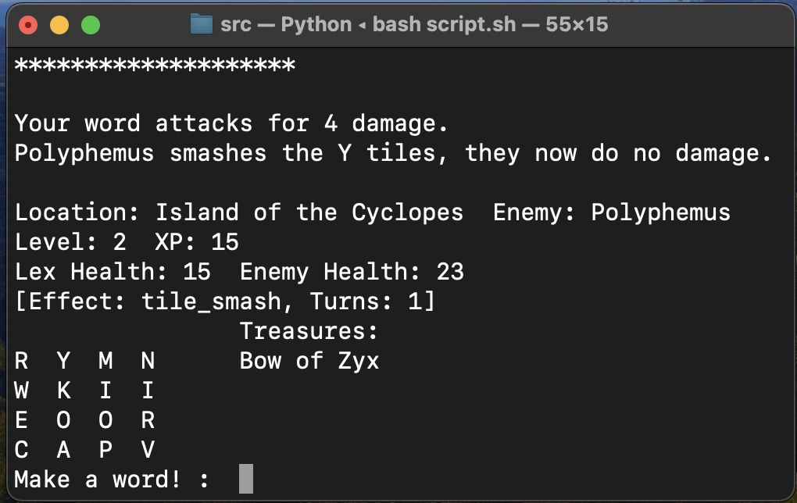

# T1A3

Jacob Smith

## Github link

[Link](https://github.com/intameli/T1A3)

## Style convention

[PEP 8](https://peps.python.org/pep-0008/)

## Features

### Core gameplay loop

The core gameplay loop consists of displaying the UI, getting input and then displaying the resulting changes. Variables from all the other features are displayed in the UI. Player health, enemy health, location, enemy name, player level and player XP are all displayed everytime. If any ailments are affecting the player they are optionally shown. Also optionally, if at least one treasure has been found they are displayed in a column. Above the input the tiles the player can use to make words are displayed. A promt asking for the player to make a word is displayed next to the user input. The finished version of this UI with ailments and treasures can be seen below.

## Implementation plan

## Help documentation
